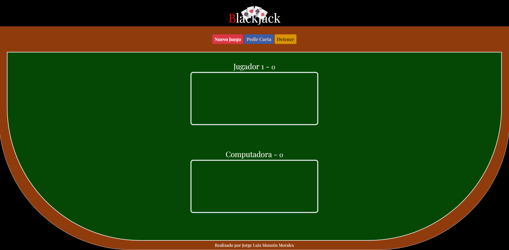

# **# Blackjack Game - Desafía a la Computadora #** #

**Autor:** Jorge Luis Monzón Morales
**Correo Electrónico:** jorge29luis10@gmail.com

"Bienvenido al Juego de Blackjack, donde compites contra la computadora para llegar lo más cerca posible de 21 sin pasarte. ¡Diviértete y buena suerte!" 

utilizando tecnologias:

- HTML
- CSS
- BOOTSTRAP
- JAVASCRIPT

Se adapto a cualquier tipo de pantalla, responsiva:

## **Modo Mobile** ##

 

## **Modo Desktop** ##

funcionalidades aplicadas al DOM de javascript son las siguientes:

- Nuevo juego : limpia la mesa para prepararse para un nuevo juego
- pedir carta : Solicita cartas de uno a uno por el usuario
- detener : no permite solicitar mas cartas y termina el turno del usuario, para continuar con la computadora
